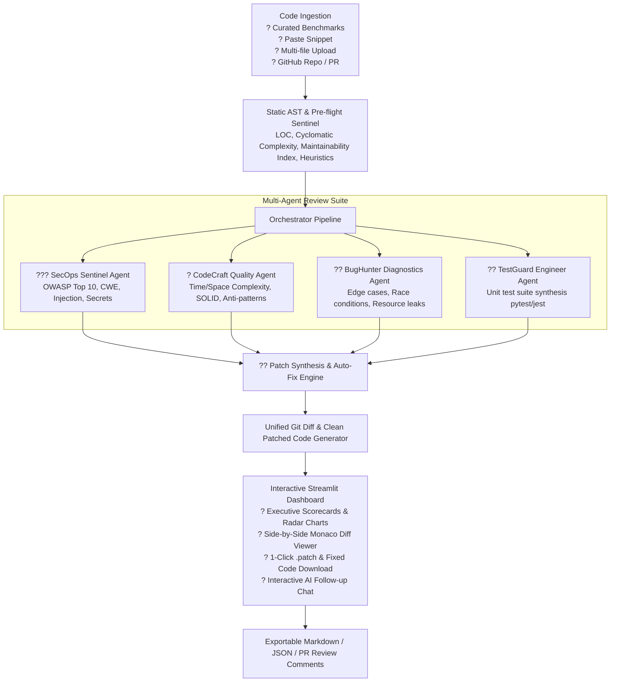

# ??? CodeSentinel AI ? Autonomous AI Code Reviewer & Bug Fixing Agent

[](https://www.python.org/downloads/)
[](https://streamlit.io)
[](LICENSE)
[]()

> **Built for the Generative AI Developer Intern 1-Week Build Sprint (September 2026)**  
> **Author:** Generative AI Developer Intern Candidate  
> **Submission Deadline:** 07 September, 2026  

---

## ?? Executive Summary & Problem Solved

Modern software development moves fast, but manual code reviews often fail to catch subtle security vulnerabilities (OWASP Top 10 / CWEs), algorithmic complexity bottlenecks, concurrency race conditions, and resource leaks.

**CodeSentinel AI** is an end-to-end, production-grade **Autonomous Code Review & Bug Fixing Agent**. It employs a coordinated **Multi-Agent Architecture** to:
1. Perform pre-flight static Abstract Syntax Tree (AST) analysis & calculate Maintainability/Cyclomatic metrics.
2. Dispatch specialized LLM agents (SecOps Sentinel, CodeCraft Architect, BugHunter Core, TestGuard Engineer).
3. Synthesize unified git diff patches (`git diff` format) and executable refactored code.
4. Auto-generate runnable unit test suites (`pytest` / `jest`) with boundary test assertions.
5. Provide a dark glassmorphic UI with side-by-side diffing, radar metrics, and an interactive AI code assistant.

---

## ??? Architecture & Pipeline Flow



---

## ? Key Features

- **??? Deep Security Vulnerability Auditing**: Automatic taxonomy mapping to **OWASP Top 10** (A01-A10) and **CWE IDs** (CWE-89 SQLi, CWE-798 Hardcoded Secrets, CWE-362 Concurrency Races, CWE-400 Resource Exhaustion, CWE-1333 ReDoS, CWE-1321 Prototype Pollution).
- **?? Code Quality & Radar Dimension Chart**: Real-time evaluation of Security (0-100), Reliability (0-100), Performance (0-100), and Maintainability (0-100) comparing Original vs AI Patched code.
- **?? Side-by-Side Diff Viewer & One-Click Patching**: Visual before/after code comparison, with instant download for both `.patch` unified diffs and complete refactored source files.
- **?? Automated Unit Test Generation**: Generates complete, runnable test suites (`pytest` or `jest`) targeting regression testing and critical boundary vulnerabilities.
- **?? Interactive AI Code Assistant**: Context-aware conversational chat assistant allowing developers to ask follow-up questions about the audit findings and trade-offs.
- **?? Public GitHub & Multi-Language Ingestion**: Ingest raw code snippets, upload multi-file archives, or pull files directly from public GitHub URLs. Supports Python, JavaScript, TypeScript, Go, Rust, Java, C++, and SQL.
- **?? Zero-Config Demo Mode & Multi-LLM Support**: Works seamlessly out-of-the-box with Google Gemini (free API tier), OpenAI (`gpt-4o-mini`), Groq (`llama-3.3-70b`), as well as a pre-loaded Offline Benchmark Suite for instant evaluation without an API key.

---

## ?? Curated Vulnerability Benchmark Suite

CodeSentinel AI comes pre-loaded with real-world reproducible vulnerability scenarios:
1. **`sql_injection.py`**: Raw SQLite interpolation, hardcoded production credentials, and connection descriptor leak.
2. **`race_condition.py`**: Multi-threaded bank transfer with check-then-act race condition causing double spending.
3. **`memory_leak.py`**: Unbounded global cache memory leak and unclosed socket file descriptors.
4. **`broken_auth.py`**: Insecure JWT decoding bypassing signature verification with weak secret.
5. **`redos_regex.js`**: Catastrophic backtracking regular expression (ReDoS) and JavaScript prototype pollution.

---

## ?? Quick Start (Local Setup)

### 1. Clone the repository
```bash
git clone https://github.com/your-username/codesentinel-ai.git
cd codesentinel-ai
```

### 2. Create and activate a virtual environment
```bash
python -m venv .venv
# Windows:
.venv\Scriptsctivate
# macOS/Linux:
source .venv/bin/activate
```

### 3. Install dependencies
```bash
pip install -r requirements.txt
```

### 4. (Optional) Configure API Key
Copy the example environment file:
```bash
cp .env.example .env
```
Add your free Google Gemini key or OpenAI key:
```env
GEMINI_API_KEY=your_gemini_api_key_here
```
*(Note: You can also skip this and test the app immediately in Demo Mode or input your key directly into the web UI sidebar).*

### 5. Launch the Web Application
```bash
streamlit run app.py
```
Open your browser at `http://localhost:8501`.

---

## ?? Running Automated Tests

Run the full pytest suite to verify all static analysis, patch engine, and orchestrator components:
```bash
pytest -v
```

---

## ?? Free 1-Click Cloud Deployment Guide

This repository is pre-configured for free instant deployment to:

### Option A: Streamlit Community Cloud (Recommended - 1 Click)
1. Fork / Push this repo to your GitHub account.
2. Go to [share.streamlit.io](https://share.streamlit.io).
3. Connect your GitHub repo, select `app.py` as the entry file, and click **Deploy**.
4. (Optional) Add `GEMINI_API_KEY` under App Settings -> Secrets.

### Option B: Hugging Face Spaces
1. Create a new Space on [Hugging Face Spaces](https://huggingface.co/spaces) with **Streamlit** SDK.
2. Push this repo to the Space Git remote.

---

## ??? Technology Stack

| Layer | Technologies |
| :--- | :--- |
| **Generative AI & LLM** | Google Gemini SDK (`gemini-1.5-flash`, `gemini-1.5-pro`), OpenAI API, Groq Cloud |
| **Static & AST Analysis** | Python `ast`, `re`, Halstead & Cyclomatic Complexity metrics |
| **Diff & Patching Engine**| `difflib`, Unified Diff synthesis, side-by-side patch rendering |
| **Frontend & UI** | Streamlit 1.36+, Plotly (Radar Charts), Glassmorphic Dark CSS |
| **Testing & CI** | Pytest, Concurrent Threading Test Harnesses |

---

## ?? License
This project is open-source under the [MIT License](LICENSE).
